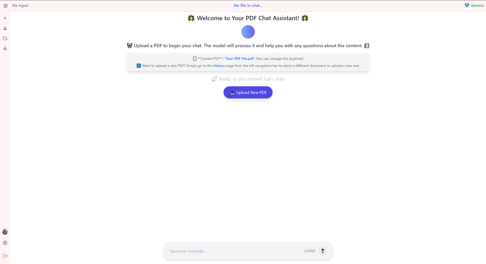

### **Screenshots and Demo**

#### Project Screenshots
Below are screenshots of the project frontend showcasing key features and design:

1. **Homepage**
   

2. **Chat Interface**
   

3. **PDF Upload and Parsing**
   

4. **Dashboard**
   

5. **Chat and Response**
   


---
#### Video Demo

> Watch the complete project walkthrough on OneDrive:  
✨ [**Click Here to Watch the Demo**](https://drive.google.com/file/d/1332duVBuI06ZGelWHwBWR_OuJyQzvzTt/view?usp=sharing) ✨

---


# Enhanced RAG Website with MERN Stack and Pinecone Integration

This project started as a fork of a repository designed to teach the basics of building a RAG (Retrieval-Augmented Generation) website. I have significantly extended the functionality by adding new features, utilizing advanced technologies, and addressing edge cases.

## Key Features
1. **RAG (Retrieval-Augmented Generation) Integration**: 
   - Built a feature to parse user-uploaded PDFs.
   - Implemented context-based queries using Pinecone vector database and an LLM for chatbot functionality.

2. **Complete MERN Stack Implementation**:
   - Developed the backend with **Node.js** and **Express.js**.
   - Integrated **MongoDB** for data storage and **React** for a dynamic frontend.

3. **Advanced Enhancements**:
   - Added support for PDF parsing and vectorization for efficient retrieval.
   - Incorporated custom prompt engineering for generating accurate responses.
   - Improved validations and enhanced session management for smoother user interactions.

## Fork Note
This repository contains the foundational components and codebase of the project. Some advanced features, such as the finalized RAG implementation, were developed in a private repository due to organizational constraints.

---

## Installation and Setup

### Prerequisites
- Node.js installed on your system
- MongoDB running locally or on a cloud service
- Pinecone API key for database interaction

### Steps
1. Clone this repository:
   ```bash
   git clone <repo_url>
   cd <repo_name>


Install dependencies:

bash
Copy code
npm install
Set up environment variables:

Create a .env file in the root directory.
Add the required variables:
makefile
Copy code
PINECONE_API_KEY=<your_api_key>

Install the required PDF parser:

bash
Copy code
npm install pdf-parser
Fix the PDF parser issue:

Navigate to the node_modules/pdf-parser directory.
Open the source code file and comment out the if statement in the relevant check.
This step resolves a random file check error in the module.
Start the development server:

bash
Copy code
npm run dev